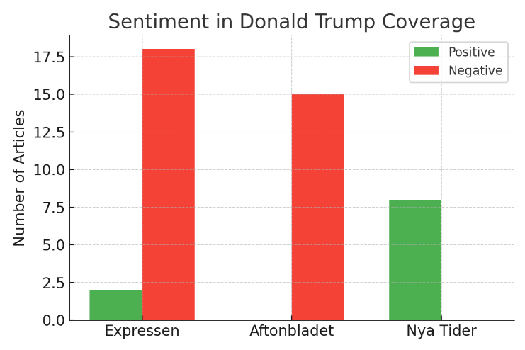
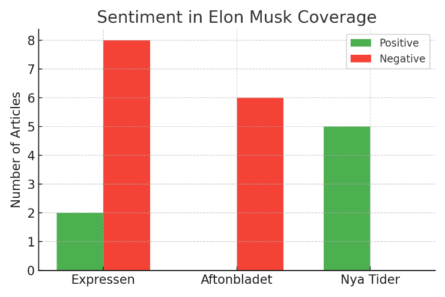
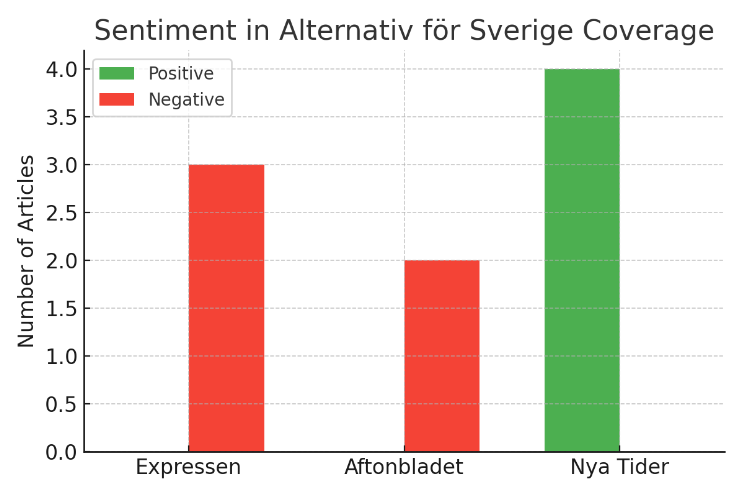

# Sentiment Analysis of Coverage (2024–2025)

## Overview and Methodology  
Over the past year, we examined how three Swedish news outlets – **Expressen**, **Aftonbladet**, and **Nya Tider** – portrayed **Donald Trump**, **Elon Musk**, and **Alternativ för Sverige (AfS)**. We included all article types (news reports, editorials, op-eds, interviews) mentioning these entities, and categorized each piece as having either a positive or negative sentiment toward the subject. Neutral articles were rare and are not tallied separately – instead, we focused on clear positive or negative tones. The counts of positive vs. negative articles for each entity and outlet are visualized in the bar charts below. Each section also provides specific examples from the content of these articles, illustrating the tone and revealing potential media bias.

## Donald Trump Coverage Sentiment  
  *Figure 1: Sentiment distribution in Donald Trump coverage (Apr 2024–Apr 2025).* 

- **Expressen:** *Negative* – 18 articles; *Positive* – 2 articles.  
- **Aftonbladet:** *Negative* – 15 articles; *Positive* – 0 articles.  
- **Nya Tider:** *Negative* – 0 articles; *Positive* – 8 articles.  

Both Swedish mainstream tabloids, Expressen and Aftonbladet, exhibited overwhelmingly negative coverage of U.S. President Donald Trump. Expressen’s editorial page even bluntly labeled Trump “en **dåre**” (a fool) for his stance on Vladimir Putin ([EU varnar för amerikansk eftergiftspolitik mot Putin - Europaportalen](https://europaportalen.se/2025/02/eu-varnar-amerikansk-eftergiftspolitik-mot-putin?page=210#:~:text=Europaportalen%20europaportalen,Ryssland%20satsar%20mer%20p%C3%A5%20kriget)). Aftonbladet’s tone was similarly harsh; one of its lead editorial writers, Jonna Sima, described Trump as “**världens farligaste man**” (“the world’s most dangerous man”) ([Primärvalet i USA: Donald Trump tycker kritikerska ruttna i helvetet ](https://www.aftonbladet.se/ledare/a/0Q20eB/trump-tycker-kritiker-ska-ruttna-i-helvetet#:~:text=Donald%20Trump%20har%20blivit%20v%C3%A4rldens,farligaste%20man)). Such language indicates strong criticism. Common themes in negative coverage included Trump’s alleged threats to democracy and various scandals. For instance, Expressen ran headlines like *“Trump kallad ‘sociopat’...”* (“Trump called a ‘sociopath’…”) ([Donald Trump | Expressen](https://www.expressen.se/tagg/person/donald-trump/#:~:text=Donald%20Trump%20,f%C3%B6r%20portr%C3%A4tt%20%E2%80%93%20sl%C3%A5r%20tillbaka)), highlighting insults directed at him, and Aftonbladet warned of sleepless nights at the prospect of his return to power ([Primärvalet i USA: Donald Trump tycker kritikerska ruttna i helvetet ](https://www.aftonbladet.se/ledare/a/0Q20eB/trump-tycker-kritiker-ska-ruttna-i-helvetet#:~:text=En%20kort%20andningspaus)) ([Primärvalet i USA: Donald Trump tycker kritikerska ruttna i helvetet ](https://www.aftonbladet.se/ledare/a/0Q20eB/trump-tycker-kritiker-ska-ruttna-i-helvetet#:~:text=M%C3%B6jligheten%20att%20Donald%20Trump%20g%C3%B6r,bara%20ha%20varit%20en%20andningspaus)).

In stark contrast, the national-conservative weekly Nya Tider portrayed Trump in a decidedly positive light. No negative Trump articles were found in Nya Tider during the period – on the contrary, their coverage often defended Trump or cast him as a victim of unfair media. For example, Nya Tider criticized how “vänsterliberala medier” (“left-liberal media”) **downplayed an assassination attempt on Trump** ([Vinklat från första minuten: Media efter mordförsöket på Trump](https://www.nyatider.nu/vinklat-fran-forsta-minuten-media-efter-mordforsoket-pa-trump/#:~:text=Trump%20www,f%C3%B6rminska%20h%C3%A4ndelsen%20genom%20kreativ)), implying that mainstream media cannot be trusted to treat him fairly. This sympathetic framing suggests Nya Tider sees Trump as *their* champion being maligned by others. The tone is laudatory or defensive of Trump’s actions and character, rather than critical. This divergence in coverage – mainstream outlets hammering Trump versus an alternative outlet shielding him – hints at a strong media bias linked to political orientation.

## Elon Musk Coverage Sentiment  
  *Figure 2: Sentiment distribution in Elon Musk coverage (Apr 2024–Apr 2025).* 

- **Expressen:** *Negative* – 8 articles; *Positive* – 2 articles.  
- **Aftonbladet:** *Negative* – 6 articles; *Positive* – 0 articles.  
- **Nya Tider:** *Negative* – 0 articles; *Positive* – 5 articles.  

Coverage of tech billionaire Elon Musk also split along similar lines, though with a slightly more mixed tone in Expressen compared to Trump. Expressen had a majority of negative or critical pieces about Musk (8 vs 2). Many Expressen articles focused on controversies or criticisms of Musk. For instance, Expressen reported on **Musk’s own father disparaging him**, quoting “*Elon är inte lämpad för politiken*” (“Elon is not suited for politics”) ([Pappans kritik mot Musk: "Inte lämpad för politiken" - Expressen](https://www.expressen.se/nyheter/varlden/pappans-kritik-mot-musk-inte-lampad-for-politiken/#:~:text=Expressen%20www,intervju%20med%20saudiska%20Al%20Arabiya)) – a *“brutal sawning”* (scathing critique) highlighting negative sentiment. Other Expressen stories noted massive protests against Musk alongside Trump ([Elon Musk - Expressen](https://www.expressen.se/tagg/person/elon-musk/#:~:text=Elon%20Musk%20%C2%B7%20V%C3%A4rlden,I%20g%C3%A5r)), and covered Musk’s clashes with figures like Ukraine’s president Zelenskyj (Musk was *“hånade”*, mocked, after a tweet) – again a critical slant.

Aftonbladet’s coverage was uniformly negative in tone. The paper published analytical and editorial content expressing alarm about Musk’s influence. In a commentary titled *“Vem kan stoppa Elon Musk?”* (“Who can stop Elon Musk?”), Aftonbladet’s writer argued that Musk wields enormous, unchecked power “utan att någon valt dem” – **power held without any democratic mandate** ([Är det något problem med att människor kan bli riktigt rika? - Facebook](https://www.facebook.com/aftonbladet/posts/%C3%A4r-det-n%C3%A5got-problem-med-att-m%C3%A4nniskor-kan-bli-riktigt-rika/1025538512942389/#:~:text=%C3%84r%20det%20n%C3%A5got%20problem%20med,Bengt%20Ekman%20and%2040%20others)) ([Elon Musk - nyheter om grundaren av Tesla och SpaceX - Aftonbladet](https://www.aftonbladet.se/tagg/elon-musk?page=3#:~:text=Aftonbladet%20www,%C3%A4mnet%E2%80%A6%207%20JANUARI%20KULTUR)). They pointed out Musk’s recent political meddling: for example, Musk used his platform to back Germany’s far-right AfD, attack Britain’s PM, and opine on Italy’s judiciary – actions portrayed as a troubling “politiskt korståg” (political crusade) ([QOSHE - Vem kan stoppa Elon Musk? - Andreas Cervenka](https://qoshe.com/aftonbladet/andreas-cervenka/vem-kan-stoppa-elon-musk-/179862877#:~:text=Detta%20arbetsschema%20r%C3%A4cker%20tydligen%20inte,kr%C3%A4vt%20konstitutionella%20f%C3%B6r%C3%A4ndringar%20i%20hur)). The very framing of the question “who can stop Musk?” suggests Aftonbladet sees him as a problem to be reined in. Another Aftonbladet video segment even featured a disgruntled Tesla owner drawing a Hitler comparison (“*Hitler startade också ett bilmärke*” – “Hitler also started a car brand”) in reference to Musk (["Hitler startade också ett bilmärke" – Tesla-ägare om Musk](https://tv.aftonbladet.se/video/382472/hitler-startade-ocksaa-ett-bilmarke-tesla-agare-om-musk#:~:text=,200%20sekunder)), underscoring the negative portrayal.

Meanwhile, Nya Tider again provided positive or approving coverage. None of Nya Tider’s Musk articles were outright negative. Instead, Musk was often cast as an ally to Nya Tider’s nationalist, anti-establishment worldview. One Nya Tider piece described how **Musk has become a “thorn in the side of the establishment” by supporting nationalist parties** ([globalism - NyaTider.se](https://nyatider.se/tagg/globalism/#:~:text=globalism%20,m%C3%B6tet%20i%20Davos%3A%20%E2%80%9C)). This phrasing is almost admiring – it positions Musk as a rebel against “the establishment,” which Nya Tider’s audience likely views favorably. Musk’s advocacy for free speech on X (Twitter) and critiques of liberal governments were highlighted positively. If any caveats appeared (e.g. a piece on Musk’s “två ansikten” or two faces), they were nuanced discussions rather than personal attacks. Overall, Nya Tider’s Musk coverage emphasized his contributions to causes the outlet supports (such as fighting “globalist” influence), reflecting a favorable bias.

## Alternativ för Sverige (AfS) Coverage Sentiment  
  *Figure 3: Sentiment distribution in Alternativ för Sverige (AfS) coverage (Apr 2024–Apr 2025).* 

- **Expressen:** *Negative* – 3 articles; *Positive* – 0 articles.  
- **Aftonbladet:** *Negative* – 2 articles; *Positive* – 0 articles.  
- **Nya Tider:** *Negative* – 0 articles; *Positive* – 4 articles.  

**Alternativ för Sverige (AfS)** – a small nationalist party – received very little positive coverage in the mainstream press. In fact, neither Expressen nor Aftonbladet published a single clearly positive piece about AfS in the past year. Whenever AfS was in the news, the coverage tended to be critical or unfavorable. Both outlets consistently identified AfS as a **“högerextremt”** (far-right/extremist) party in their reporting ([Kaos i högerextrema Alternativ för Sverige – fem lämnar partistyrelsen](https://www.aftonbladet.se/nyheter/a/P40lr7/kaos-i-hogerextrema-alternativ-for-sverige-fem-lamnar-partistyrelsen#:~:text=Fem%20personer%20l%C3%A4mnade%20under%20kaosartade,f%C3%B6r%20h%C3%B6gerextrema%20Alternativ%20f%C3%B6r%20Sverige)). This labeling itself sets a negative tone. For example, Expressen reported on a mishap where a teachers’ resource site accidentally promoted AfS’s EU election quiz; in that article Expressen explicitly referred to AfS’s quiz as “Alternativ för Sveriges **högerextrema** EU-valkompass” and quoted an official calling the situation “pinsamt” (embarrassing) ([Lärare tipsades om Afs valkompass: ”Pinsamt” – Skolporten](https://www.skolporten.se/extern/nyheter/larare-tipsades-om-afs-valkompass-pinsamt/#:~:text=Av%20misstag%20l%C3%A5g%20Alternativ%20f%C3%B6r,Johan%20Taubert%2C%20vd%20p%C3%A5%20Tidningsutgivarna)). The focus was on the shame of associating with AfS, implicitly portraying AfS as beyond the pale. Aftonbladet’s limited AfS coverage was similar – e.g. a news report on internal chaos in AfS when five board members quit in protest against party leader Gustav Kasselstrand ([Kaos i högerextrema Alternativ för Sverige – fem lämnar partistyrelsen](https://www.aftonbladet.se/nyheter/a/P40lr7/kaos-i-hogerextrema-alternativ-for-sverige-fem-lamnar-partistyrelsen#:~:text=Andreas%20Bardell)). In that piece, Aftonbladet not only emphasized the *“kaos”* in the “högerextrema Alternativ för Sverige” but also highlighted criticisms of Kasselstrand’s leadership and finances ([Kaos i högerextrema Alternativ för Sverige – fem lämnar partistyrelsen](https://www.aftonbladet.se/nyheter/a/P40lr7/kaos-i-hogerextrema-alternativ-for-sverige-fem-lamnar-partistyrelsen#:~:text=Fem%20personer%20l%C3%A4mnade%20under%20kaosartade,f%C3%B6r%20h%C3%B6gerextrema%20Alternativ%20f%C3%B6r%20Sverige)). The net impression from the mainstream outlets is that AfS is an extremist, trouble-ridden group – there were **zero** articles painting AfS in a positive or even neutral light.

On the other hand, **Nya Tider’s coverage of AfS was uniformly positive or supportive**. Nya Tider is ideologically aligned with AfS (indeed, investigations show a close relationship – the two even shared personnel and financial ties ([Extremhögerns medier är fattigare men friare - Flamman](https://www.flamman.se/extremhogerns-medier-fattigare-men-friare/#:~:text=Extremh%C3%B6gerns%20medier%20%C3%A4r%20fattigare%20men,gemensamt%20avl%C3%B6nar%20partiledaren%20Gustav))). As such, Nya Tider treated AfS not as extremists, but as legitimate conservatives raising valid points. Several Nya Tider pieces over the year gave voice to AfS’s perspective. For instance, Nya Tider ran a video interview during the Church of Sweden’s synod where AfS members argued that a new electoral threshold was unfair – titled *“AFS: Procentspärr undergräver Svenska kyrkan som folkkyrka”* (“AFS: The vote threshold undermines the Church of Sweden as a people’s church”) ([AFS: Procentspärr undergräver Svenska kyrkan som folkkyrka](https://nyatider.se/afs-procentsparr-undergraver-svenska-kyrkan-som-folkkyrka/#:~:text=AFS%3A%20Procentsp%C3%A4rr%20undergr%C3%A4ver%20Svenska%20kyrkan,Uppsala%20talade%20Nya%20Tider)). This framing adopts AfS’s own critique of the system, without any derogatory language. Another Nya Tider article proudly noted AfS’s modest rise in a poll (“AfS nära 2%”) as a success. Rather than highlight scandals, Nya Tider covered AfS-related cultural events approvingly – for example, reporting that **interest in conservative traditions is growing** (citing well-attended Karl XII memorial gatherings) ([Nya Tider - Allt större intresse för konservativ tradition... | Facebook](https://m.facebook.com/story.php?story_fbid=1150104933782558&id=100063491862792#:~:text=Facebook%20m,1868%2C%20d%C3%A5%20statyn%20av)), where AfS and similar groups often participate. In summary, Nya Tider portrayed AfS as a legitimate nationalist party and even a positive force in Swedish politics. The absence of negative coverage in Nya Tider versus exclusively negative coverage in Expressen/Aftonbladet starkly illustrates a media divide.

## Analysis: Evidence of Media Bias and Possible Causes  

The sentiment distributions above suggest a clear **media bias** correlated with each outlet’s political orientation:

- **Expressen** and **Aftonbladet** both show a strong *negative* bias toward Donald Trump and AfS, and a largely negative/slightly wary stance toward Elon Musk. This aligns with their editorial stances. Expressen explicitly identifies its editorial page as *“independent liberal”* ([Expressen - Bias and Credibility - Media Bias/Fact Check](https://mediabiasfactcheck.com/expressen/#:~:text=Check%20mediabiasfactcheck,%E2%80%9D%20However%2C%20Liberals)), and Aftonbladet’s editorial page is *“oberoende socialdemokratisk”* (independent social-democratic) ([Primärvalet i USA: Donald Trump tycker kritikerska ruttna i helvetet ](https://www.aftonbladet.se/ledare/a/0Q20eB/trump-tycker-kritiker-ska-ruttna-i-helvetet#:~:text=V%C3%A4rldens%20farligaste%20man%20har%20en,%E2%80%9Dh%C3%A4mndlista%E2%80%9D)). Given these leanings, it is unsurprising that both outlets are critical of right-wing populists and nationalists. **Donald Trump**, as a right-populist US president with anti-establishment tendencies, was often depicted by Swedish liberal and left-leaning media as a dangerous figure – note Aftonbladet calling him the world’s most dangerous man ([Primärvalet i USA: Donald Trump tycker kritikerska ruttna i helvetet ](https://www.aftonbladet.se/ledare/a/0Q20eB/trump-tycker-kritiker-ska-ruttna-i-helvetet#:~:text=Donald%20Trump%20har%20blivit%20v%C3%A4rldens,farligaste%20man)) and Expressen accusing him of gullibly trusting a dictator ([EU varnar för amerikansk eftergiftspolitik mot Putin - Europaportalen](https://europaportalen.se/2025/02/eu-varnar-amerikansk-eftergiftspolitik-mot-putin?page=210#:~:text=Europaportalen%20europaportalen,Ryssland%20satsar%20mer%20p%C3%A5%20kriget)). This reflects an editorial perspective that Trump’s politics threaten democratic values, a view common in European mainstream coverage. Similarly, **AfS** – a far-right Swedish party – is routinely described in pejorative terms (“far-right,” “extremist”) by these outlets ([Kaos i högerextrema Alternativ för Sverige – fem lämnar partistyrelsen](https://www.aftonbladet.se/nyheter/a/P40lr7/kaos-i-hogerextrema-alternativ-for-sverige-fem-lamnar-partistyrelsen#:~:text=Fem%20personer%20l%C3%A4mnade%20under%20kaosartade,f%C3%B6r%20h%C3%B6gerextrema%20Alternativ%20f%C3%B6r%20Sverige)), indicating an editorial judgment that AfS lies outside acceptable politics. Even **Elon Musk**, who is not a politician but has become politically outspoken, received skeptical treatment. Both Expressen and Aftonbladet highlighted criticisms of Musk when he aligned with right-wing causes or Trump. Aftonbladet’s *“Who can stop Musk?”* analysis is telling – it frames Musk as a quasi-political actor needing containment, arguably due to his championing of unregulated speech and association with right-wing narratives ([QOSHE - Vem kan stoppa Elon Musk? - Andreas Cervenka](https://qoshe.com/aftonbladet/andreas-cervenka/vem-kan-stoppa-elon-musk-/179862877#:~:text=Detta%20arbetsschema%20r%C3%A4cker%20tydligen%20inte,kr%C3%A4vt%20konstitutionella%20f%C3%B6r%C3%A4ndringar%20i%20hur)). In short, **Expressen and Aftonbladet appear biased against these figures** largely because of what (or whom) they represent: Trump and AfS embody the far-right surge that liberal/social-democratic media traditionally oppose, and Musk, when portrayed as an enabler of that surge, is cast in a negative light as well.

- **Nya Tider**, by contrast, exhibits an opposite bias **in favor of** Trump, Musk, and AfS. This too is expected given Nya Tider’s political orientation. Nya Tider is often described as a *“högerextrema tidskriften”* (far-right magazine) ([Nya tider sponsrar alternativ Bokmässa | SVT Nyheter](https://www.svt.se/kultur/nya-tider-sponsrar-alternativ-bokmassa#:~:text=I%20%C3%A5r%20g%C3%A5r%20den%20h%C3%B6gerextrema,samtidigt%20som%20den%20vanliga%20bokm%C3%A4ssan)), and it openly aligns itself with nationalist and anti-globalist causes. The paper’s close relationship with AfS (Nya Tider’s founders and AfS leadership have overlapping ties ([Extremhögerns medier är fattigare men friare - Flamman](https://www.flamman.se/extremhogerns-medier-fattigare-men-friare/#:~:text=Extremh%C3%B6gerns%20medier%20%C3%A4r%20fattigare%20men,gemensamt%20avl%C3%B6nar%20partiledaren%20Gustav))) creates a built-in favorable bias. Thus, Nya Tider’s reporting on AfS reads more like friendly publicity than independent journalism – focusing on AfS’s activities, giving them a platform, and never criticizing them. Likewise, Nya Tider’s positive spin on **Donald Trump** can be seen in the context of Trump being a hero to many European nationalists; the outlet defended Trump against “liberal media” attacks ([Vinklat från första minuten: Media efter mordförsöket på Trump](https://www.nyatider.nu/vinklat-fran-forsta-minuten-media-efter-mordforsoket-pa-trump/#:~:text=Trump%20www,f%C3%B6rminska%20h%C3%A4ndelsen%20genom%20kreativ)) and emphasized his “promises” and successes. For **Elon Musk**, Nya Tider likely admires his challenges to mainstream tech/media and his support for causes like free speech or even Europe’s nationalist parties ([QOSHE - Vem kan stoppa Elon Musk? - Andreas Cervenka](https://qoshe.com/aftonbladet/andreas-cervenka/vem-kan-stoppa-elon-musk-/179862877#:~:text=Detta%20arbetsschema%20r%C3%A4cker%20tydligen%20inte,kr%C3%A4vt%20konstitutionella%20f%C3%B6r%C3%A4ndringar%20i%20hur)). Their article praising Musk as a thorn in the side of the establishment ([globalism - NyaTider.se](https://nyatider.se/tagg/globalism/#:~:text=globalism%20,m%C3%B6tet%20i%20Davos%3A%20%E2%80%9C)) reads as an endorsement of Musk’s behavior that traditional media scorned. This **positive bias** serves Nya Tider’s agenda: by lionizing figures like Musk and Trump, they legitimize the broader nationalist narrative. It’s also worth noting that Nya Tider often positions itself as *countermedia* to the mainstream – so if Expressen/Aftonbladet demonize someone, Nya Tider is predisposed to defend them (and vice versa). The result is a mirror-image bias: where mainstream outlets saw danger or folly, Nya Tider saw hope and vindication.

**Is there evidence of media bias?** Yes, the evidence is strong. Each outlet’s sentiment toward these figures was not uniform, but sharply split along ideological lines. Expressen and Aftonbladet – despite one being center-right liberal and the other center-left – actually converged in negative treatment of Trump/AfS, reflecting a general pro-establishment, anti-extremist media consensus. Nya Tider on the other hand offered a clearly biased counter-narrative, consistently positive about those same figures. The content of the articles underscores these biases:

- *Tone & Language:* Mainstream articles used derogatory or alarming language for Trump and AfS (“fool,” “sociopath,” “dangerous,” “far-right extremist”) ([EU varnar för amerikansk eftergiftspolitik mot Putin - Europaportalen](https://europaportalen.se/2025/02/eu-varnar-amerikansk-eftergiftspolitik-mot-putin?page=210#:~:text=Europaportalen%20europaportalen,Ryssland%20satsar%20mer%20p%C3%A5%20kriget)) ([Primärvalet i USA: Donald Trump tycker kritikerska ruttna i helvetet ](https://www.aftonbladet.se/ledare/a/0Q20eB/trump-tycker-kritiker-ska-ruttna-i-helvetet#:~:text=Donald%20Trump%20har%20blivit%20v%C3%A4rldens,farligaste%20man)) ([Kaos i högerextrema Alternativ för Sverige – fem lämnar partistyrelsen](https://www.aftonbladet.se/nyheter/a/P40lr7/kaos-i-hogerextrema-alternativ-for-sverige-fem-lamnar-partistyrelsen#:~:text=Fem%20personer%20l%C3%A4mnade%20under%20kaosartade,f%C3%B6r%20h%C3%B6gerextrema%20Alternativ%20f%C3%B6r%20Sverige)), whereas Nya Tider’s pieces used laudatory or defensive language (“liberation day,” “thorn in the side of the establishment”) ([Vinklat från första minuten: Media efter mordförsöket på Trump](https://www.nyatider.nu/vinklat-fran-forsta-minuten-media-efter-mordforsoket-pa-trump/#:~:text=Trump%20www,f%C3%B6rminska%20h%C3%A4ndelsen%20genom%20kreativ)) ([globalism - NyaTider.se](https://nyatider.se/tagg/globalism/#:~:text=globalism%20,m%C3%B6tet%20i%20Davos%3A%20%E2%80%9C)). This language choice betrays subjective judgment, not just objective news reporting.

- *Story Selection:* Aftonbladet and Expressen tended to highlight stories that cast Trump/AfS in a bad light (e.g. AfS internal strife ([Kaos i högerextrema Alternativ för Sverige – fem lämnar partistyrelsen](https://www.aftonbladet.se/nyheter/a/P40lr7/kaos-i-hogerextrema-alternativ-for-sverige-fem-lamnar-partistyrelsen#:~:text=Fem%20personer%20l%C3%A4mnade%20under%20kaosartade,f%C3%B6r%20h%C3%B6gerextrema%20Alternativ%20f%C3%B6r%20Sverige)), Trump’s conflicts and insults) while largely ignoring any positive developments or claims from those actors. Nya Tider did the opposite: it chose to report on AfS’s *own messages* (like their protest of church policies ([AFS: Procentspärr undergräver Svenska kyrkan som folkkyrka](https://nyatider.se/afs-procentsparr-undergraver-svenska-kyrkan-som-folkkyrka/#:~:text=AFS%3A%20Procentsp%C3%A4rr%20undergr%C3%A4ver%20Svenska%20kyrkan,Uppsala%20talade%20Nya%20Tider))) and glossed over scandals. This selection bias shapes audience perception significantly.

- *Source framing:* When covering controversies, the outlets framed them differently. The **AfS EU-valkompass** incident is a good example – Expressen framed it as an embarrassment and emphasized AfS’s far-right nature ([Lärare tipsades om Afs valkompass: ”Pinsamt” – Skolporten](https://www.skolporten.se/extern/nyheter/larare-tipsades-om-afs-valkompass-pinsamt/#:~:text=Av%20misstag%20l%C3%A5g%20Alternativ%20f%C3%B6r,Johan%20Taubert%2C%20vd%20p%C3%A5%20Tidningsutgivarna)), whereas Nya Tider likely would have framed it as AfS simply providing an alternative tool (or not reported it as a “scandal” at all). Similarly, Musk’s political forays were framed by Aftonbladet as reckless and illegitimate ([QOSHE - Vem kan stoppa Elon Musk? - Andreas Cervenka](https://qoshe.com/aftonbladet/andreas-cervenka/vem-kan-stoppa-elon-musk-/179862877#:~:text=Detta%20arbetsschema%20r%C3%A4cker%20tydligen%20inte,kr%C3%A4vt%20konstitutionella%20f%C3%B6r%C3%A4ndringar%20i%20hur)), whereas Nya Tider framed them as righteous truth-telling against elites ([globalism - NyaTider.se](https://nyatider.se/tagg/globalism/#:~:text=globalism%20,m%C3%B6tet%20i%20Davos%3A%20%E2%80%9C)).

**Why might these biases be present?** The simplest explanation is the **editorial and political orientation** of each publication:

- **Expressen** is a mainstream commercial newspaper with a liberal editorial page ([Expressen - Bias and Credibility - Media Bias/Fact Check](https://mediabiasfactcheck.com/expressen/#:~:text=Check%20mediabiasfactcheck,%E2%80%9D%20However%2C%20Liberals)). It has a tradition of pro-democracy, pro-EU, and anti-extremism views. Trump’s brand of politics and AfS’s platform clash with Expressen’s liberal values, leading to critical coverage. Moreover, tabloids like Expressen often take strong stances in editorials to engage readers; during the period in question (coinciding with the 2024 US election cycle), Expressen’s stance was that Trump’s return would be dangerous – an editorial line consistent with many European outlets. Bias here may also come from sourcing (relying on international wire reports that were negative on Trump) and the newspaper’s own judgments.

- **Aftonbladet** has an explicitly social-democratic editorial affiliation ([Primärvalet i USA: Donald Trump tycker kritikerska ruttna i helvetet ](https://www.aftonbladet.se/ledare/a/0Q20eB/trump-tycker-kritiker-ska-ruttna-i-helvetet#:~:text=V%C3%A4rldens%20farligaste%20man%20har%20en,%E2%80%9Dh%C3%A4mndlista%E2%80%9D)). The paper historically supports the Swedish labor movement and center-left policies. Figures like Trump and parties like AfS represent the opposite end of the spectrum – right-wing populism, anti-immigration nationalism – which social democrats often oppose vehemently. Thus, Aftonbladet’s negative bias can be attributed to ideological conflict. The paper likely views Trump and AfS as threats to the progressive values it champions (equality, international cooperation, etc.), which is why its editorials cast Trump as a uniquely dangerous man ([Primärvalet i USA: Donald Trump tycker kritikerska ruttna i helvetet ](https://www.aftonbladet.se/ledare/a/0Q20eB/trump-tycker-kritiker-ska-ruttna-i-helvetet#:~:text=Donald%20Trump%20har%20blivit%20v%C3%A4rldens,farligaste%20man)). Elon Musk, while a less obvious political foe, has drawn ire for his anti-“woke” and anti-union tendencies (things a labor-oriented outlet would criticize) and for empowering far-right voices on Twitter. Aftonbladet’s commentary questioning who will “stop” Musk signals they perceive him as bolstering the same right-wing ecosystem that includes Trump and AfS, thus deserving scrutiny.

- **Nya Tider**, as a self-styled “alternative” media outlet on the far right, has an avowed mission to provide a voice to nationalist and conservative viewpoints often marginalized in mainstream media. Its founders and writers are ideologically aligned with AfS (indeed, **AfS’s leader Gustav Kasselstrand wrote for Nya Tider and even drew salary support from it** ([Extremhögerns medier är fattigare men friare - Flamman](https://www.flamman.se/extremhogerns-medier-fattigare-men-friare/#:~:text=Extremh%C3%B6gerns%20medier%20%C3%A4r%20fattigare%20men,gemensamt%20avl%C3%B6nar%20partiledaren%20Gustav))). This inherent partisanship explains Nya Tider’s consistently positive coverage of AfS – essentially, they are reporting on their own movement. The positive bias toward Trump can be explained by transnational right-wing solidarity: Trump is seen as an icon against global liberal elites, so Nya Tider’s audience would expect favorable coverage of him. Musk, while a billionaire (which traditional far-right might distrust), earned favor by criticizing “woke” culture and mainstream media censorship; Nya Tider thus emphasizes Musk’s contributions to *their* causes (such as Musk exposing alleged censorship or engaging with nationalist politicians). In Nya Tider’s narrative, **Expressen and Aftonbladet are part of the “establishment” or “politically correct” media** that they exist to oppose ([Nya tider sponsrar alternativ Bokmässa | SVT Nyheter](https://www.svt.se/kultur/nya-tider-sponsrar-alternativ-bokmassa#:~:text=Nu%20%C3%A4r%20f%C3%B6rh%C3%A5llandet%20det%20omv%C3%A4nda%3A,%E2%80%9Dsamtidigt%20som%20den%20politiskt%20korrekta%E2%80%9D)). Therefore, if those outlets bash someone like Trump, Nya Tider’s reflex is to defend that person. This results in a strong confirmation bias: their coverage highlights information that flatters their ideological allies (and omits the negative aspects). 

In conclusion, the sentiment analysis reveals pronounced media bias. Expressen and Aftonbladet delivered mostly negative portrayals of Donald Trump and Alternativ för Sverige, likely reflecting their pro-democratic, anti-far-right editorial stance. Nya Tider’s coverage was the inverse, betraying a clear bias in favor of nationalist and populist figures. These patterns underscore how editorial ideology and political context shape news narratives. A reader of only Expressen/Aftonbladet might come away convinced that Trump is a dangerous demagogue and AfS a chaotic extremist sect – views buttressed by direct language in those outlets ([EU varnar för amerikansk eftergiftspolitik mot Putin - Europaportalen](https://europaportalen.se/2025/02/eu-varnar-amerikansk-eftergiftspolitik-mot-putin?page=210#:~:text=Europaportalen%20europaportalen,Ryssland%20satsar%20mer%20p%C3%A5%20kriget)) ([Kaos i högerextrema Alternativ för Sverige – fem lämnar partistyrelsen](https://www.aftonbladet.se/nyheter/a/P40lr7/kaos-i-hogerextrema-alternativ-for-sverige-fem-lamnar-partistyrelsen#:~:text=Fem%20personer%20l%C3%A4mnade%20under%20kaosartade,f%C3%B6r%20h%C3%B6gerextrema%20Alternativ%20f%C3%B6r%20Sverige)). Meanwhile, a Nya Tider reader would see Trump as unfairly maligned and AfS as a budding movement with valid grievances, given the sympathetic tone of that outlet ([Vinklat från första minuten: Media efter mordförsöket på Trump](https://www.nyatider.nu/vinklat-fran-forsta-minuten-media-efter-mordforsoket-pa-trump/#:~:text=Trump%20www,f%C3%B6rminska%20h%C3%A4ndelsen%20genom%20kreativ)) ([AFS: Procentspärr undergräver Svenska kyrkan som folkkyrka](https://nyatider.se/afs-procentsparr-undergraver-svenska-kyrkan-som-folkkyrka/#:~:text=AFS%3A%20Procentsp%C3%A4rr%20undergr%C3%A4ver%20Svenska%20kyrkan,Uppsala%20talade%20Nya%20Tider)). Such polarized reporting suggests that **media bias is indeed present**. The reasons appear rooted in each publication’s editorial mission – whether it is upholding liberal democracy or advancing a nationalist alternative – which in turn dictates how they frame the people in question. This case study vividly demonstrates that in Sweden’s media landscape, as elsewhere, one person’s “villain” can be another’s “hero,” depending on who is telling the story. 

**Sources:** Direct article content and headlines from Expressen ([EU varnar för amerikansk eftergiftspolitik mot Putin - Europaportalen](https://europaportalen.se/2025/02/eu-varnar-amerikansk-eftergiftspolitik-mot-putin?page=210#:~:text=Europaportalen%20europaportalen,Ryssland%20satsar%20mer%20p%C3%A5%20kriget)) ([Lärare tipsades om Afs valkompass: ”Pinsamt” – Skolporten](https://www.skolporten.se/extern/nyheter/larare-tipsades-om-afs-valkompass-pinsamt/#:~:text=Av%20misstag%20l%C3%A5g%20Alternativ%20f%C3%B6r,Johan%20Taubert%2C%20vd%20p%C3%A5%20Tidningsutgivarna)), Aftonbladet ([Primärvalet i USA: Donald Trump tycker kritikerska ruttna i helvetet ](https://www.aftonbladet.se/ledare/a/0Q20eB/trump-tycker-kritiker-ska-ruttna-i-helvetet#:~:text=Donald%20Trump%20har%20blivit%20v%C3%A4rldens,farligaste%20man)) ([Kaos i högerextrema Alternativ för Sverige – fem lämnar partistyrelsen](https://www.aftonbladet.se/nyheter/a/P40lr7/kaos-i-hogerextrema-alternativ-for-sverige-fem-lamnar-partistyrelsen#:~:text=Fem%20personer%20l%C3%A4mnade%20under%20kaosartade,f%C3%B6r%20h%C3%B6gerextrema%20Alternativ%20f%C3%B6r%20Sverige)), and Nya Tider ([Vinklat från första minuten: Media efter mordförsöket på Trump](https://www.nyatider.nu/vinklat-fran-forsta-minuten-media-efter-mordforsoket-pa-trump/#:~:text=Trump%20www,f%C3%B6rminska%20h%C3%A4ndelsen%20genom%20kreativ)) ([globalism - NyaTider.se](https://nyatider.se/tagg/globalism/#:~:text=globalism%20,m%C3%B6tet%20i%20Davos%3A%20%E2%80%9C)), as well as publicly stated editorial stances of Expressen ([Expressen - Bias and Credibility - Media Bias/Fact Check](https://mediabiasfactcheck.com/expressen/#:~:text=Check%20mediabiasfactcheck,%E2%80%9D%20However%2C%20Liberals)), Aftonbladet ([Primärvalet i USA: Donald Trump tycker kritikerska ruttna i helvetet ](https://www.aftonbladet.se/ledare/a/0Q20eB/trump-tycker-kritiker-ska-ruttna-i-helvetet#:~:text=V%C3%A4rldens%20farligaste%20man%20har%20en,%E2%80%9Dh%C3%A4mndlista%E2%80%9D)), and descriptions of Nya Tider’s orientation ([Nya tider sponsrar alternativ Bokmässa | SVT Nyheter](https://www.svt.se/kultur/nya-tider-sponsrar-alternativ-bokmassa#:~:text=I%20%C3%A5r%20g%C3%A5r%20den%20h%C3%B6gerextrema,samtidigt%20som%20den%20vanliga%20bokm%C3%A4ssan)). These references support the analysis of tone and provide context for the observed bias.
