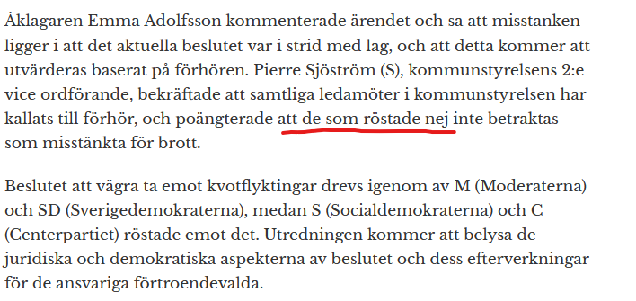

# Demokratisk problematik i Staffanstorp – rättssäkerhet, yttrandefrihet och flyktingmottagande

## Omröstningen i Staffanstorp och rättsligt efterspel

I mars 2022 beslutade kommunstyrelsen i Staffanstorp, under ledning av Christian Sonesson (M), att **vägra ta emot anvisade kvotflyktingar**, trots att detta krävdes enligt bosättningslagen ([Stopp för kvotflyktingar i Staffanstorp | SVT Nyheter](https://www.svt.se/nyheter/lokalt/skane/stopp-for-kvotflyktingar-i-staffanstorp#:~:text=Kommunen%20har%20%C3%A5lagts%20att%20vara,f%C3%B6rst%20med%20att%20rapportera%20om)). Beslutet drevs igenom av Moderaterna och Sverigedemokraterna, medan oppositionen (S och C) röstade emot stoppet ([Stopp för kvotflyktingar i Staffanstorp | SVT Nyheter](https://www.svt.se/nyheter/lokalt/skane/stopp-for-kvotflyktingar-i-staffanstorp#:~:text=kvotflyktingar%2C%20vilket%20Sydsvenskan%20var%20f%C3%B6rst,med%20att%20rapportera%20om)). Detta innebar att Sonesson och tre andra ledande politiker medvetet bröt mot lagen genom att säga nej till mottagandet av kvotflyktingar ([2022/23:5 Sanktioner mot kommuner som inte tar emot kvotflyktingar](https://data.riksdagen.se/fil/85F8A468-3F37-44B9-9D52-5E144FE4D978#:~:text=2022%2F23%3A5%20Sanktioner%20mot%20kommuner%20som,att%20inte%20ta%20emot%20kvotflyktingar)). Kommunens agerande motiverades med att man ville prioritera flyktingar från Ukraina under pågående krig i Europa ([Staffanstorp ändrar sig – tar emot kvotflyktingar | SVT Nyheter](https://www.svt.se/nyheter/lokalt/skane/staffanstorp-andrar-sig-villiga-att-ta-emot-kvotflyktingar#:~:text=I%20slutet%20av%20mars%20beslutade,prioritera%20flyktingar%20fr%C3%A5n%20krigets%20Ukraina)).

Det kontroversiella beslutet fick **omedelbara rättsliga konsekvenser**. Flera polisanmälningar kom in, och en förundersökning om *grovt tjänstefel* inleddes ([Tre kan åtalas trots röster mot kvotflyktingstopp](https://omni.se/tre-kan-atalas-trots-roster-mot-kvotflyktingstopp/a/BWOWle#:~:text=Beslutet%20drevs%20igenom%20av%20M,delgivits%20misstanke%20om%20grovt%20tj%C3%A4nstefel)). I december 2023 kallades Christian Sonesson och övriga berörda ledamöter till polisförhör som skäligen misstänkta för tjänstefel ([Efter kvotflyktingstoppet – Staffanstorps toppolitiker misstänks för grovt tjänstefel | SVT Nyheter](https://www.svt.se/nyheter/lokalt/skane/staffanstorps-styre-misstankta-for-grovt-tjanstefel--he9a2l#:~:text=Moderata%20kommunalr%C3%A5det%20Christian%20Sonesson%20,att%20v%C3%A4gra%20ta%20emot%20kvotflyktingar)) ([Efter kvotflyktingstoppet – Staffanstorps toppolitiker misstänks för grovt tjänstefel | SVT Nyheter](https://www.svt.se/nyheter/lokalt/skane/staffanstorps-styre-misstankta-for-grovt-tjanstefel--he9a2l#:~:text=%C3%85klagare%20Emma%20Adolfsson%C2%A0kommenterar%20anklagelserna%20till,Sydsvenskan)). Enligt åklagaren stred beslutet mot bosättningslagen och saknade laglig grund ([Efter kvotflyktingstoppet – Staffanstorps toppolitiker misstänks för grovt tjänstefel | SVT Nyheter](https://www.svt.se/nyheter/lokalt/skane/staffanstorps-styre-misstankta-for-grovt-tjanstefel--he9a2l#:~:text=%E2%80%93%20Nu%20ska%20de%20personer,uppfattning%2C%20s%C3%A4ger%20hon%20till%20tidningen)). Noterbart är att **9 av 10 ledamöter i kommunstyrelsen delgavs misstanke om brott**, inklusive även tre oppositionspolitiker som egentligen hade röstat emot kvotflyktingstoppet ([Tre kan åtalas trots röster mot kvotflyktingstopp](https://omni.se/tre-kan-atalas-trots-roster-mot-kvotflyktingstopp/a/BWOWle#:~:text=Beslutet%20drevs%20igenom%20av%20M,delgivits%20misstanke%20om%20grovt%20tj%C3%A4nstefel)). Den ende som *undgick misstanke* var oppositionsrådet Pierre Sjöström (S), som formellt **reserverade sig** mot beslutet i protokollet ([Tre kan åtalas trots röster mot kvotflyktingstopp](https://omni.se/tre-kan-atalas-trots-roster-mot-kvotflyktingstopp/a/BWOWle#:~:text=Undantaget%20%C3%A4r%20oppositionsr%C3%A5det%20Pierre%20Sj%C3%B6str%C3%B6m,med%20resultatet%20och%20b%C3%A4r%20ansvar)). Åklagaren tolkade det som att de som inte reserverade sig – även om de röstade nej – hade *förlikat sig med beslutet* och därmed bar ansvar ändå ([Tre kan åtalas trots röster mot kvotflyktingstopp](https://omni.se/tre-kan-atalas-trots-roster-mot-kvotflyktingstopp/a/BWOWle#:~:text=Undantaget%20%C3%A4r%20oppositionsr%C3%A5det%20Pierre%20Sj%C3%B6str%C3%B6m,med%20resultatet%20och%20b%C3%A4r%20ansvar)). Detta unika rättsfall illustrerar en situation där en kommunpolitiker i praktiken **greps för att ha röstat “nej”** (eller inte accepterat utfallet) i en omröstning, medan den som följde majoritetsbeslutet eller röstade “ja” inte ställs till svars.

## Rättsstatens principer och demokratiska värden

Staffanstorps agerande har av Länsstyrelsen kritiserats för att **utmana rättsstatens principer** ([Stopp för kvotflyktingar i Staffanstorp | SVT Nyheter](https://www.svt.se/nyheter/lokalt/skane/stopp-for-kvotflyktingar-i-staffanstorp#:~:text=%E2%80%9DR%C3%A4ttsstatens%20principer%E2%80%9D)). I en rättsstat ska *likhet inför lagen* råda och offentliga beslutsfattare är skyldiga att följa gällande lagar. Här valde kommunledningen ut en lag man *inte* ville följa, vilket enligt Länsstyrelsen är särskilt allvarligt ([Stopp för kvotflyktingar i Staffanstorp | SVT Nyheter](https://www.svt.se/nyheter/lokalt/skane/stopp-for-kvotflyktingar-i-staffanstorp#:~:text=Den%20sk%C3%A5nska%20l%C3%A4nsstyrelsen%20har%20p%C3%A5pekat,Staffanstorp%20d%C3%A4rmed%20%E2%80%9Dutmanar%20r%C3%A4ttsstatens%20principer%E2%80%9D)). Att kommunpolitiker bryter mot en tvingande lag (bosättningslagen) rubbar förtroendet för den lagstyrda ordningen och kan ses som ett hot mot rättssäkerheten. Staten har inrättat bosättningslagen just för att alla kommuner solidariskt ska dela ansvaret för flyktingmottagandet, och om enskilda kommuner ensidigt vägrar följa lagen utan sanktion riskerar hela systemet att undermineras ([2022/23:5 Sanktioner mot kommuner som inte tar emot kvotflyktingar](https://data.riksdagen.se/fil/85F8A468-3F37-44B9-9D52-5E144FE4D978#:~:text=tillsammans%20med%20Migrationsverket%20v%C3%A4ljer%20ut,v%C3%A4ljer%20att%20bryta%20mot%20lagen)). Rasmus Ling (MP) påpekade i en riksdagsfråga att utan konsekvenser för lagbrott finns en uppenbar risk att fler kommuner skulle följa Staffanstorps exempel ([2022/23:5 Sanktioner mot kommuner som inte tar emot kvotflyktingar](https://data.riksdagen.se/fil/85F8A468-3F37-44B9-9D52-5E144FE4D978#:~:text=beklagansv%C3%A4rd%2C%20men%20oaktat%20detta%20blir,fr%C3%A5ga%20statsr%C3%A5det%20Maria%20Malmer%20Stenergard)). Här kan noteras att det i dagsläget inte finns direkta statliga sanktioner mot kommuner som bryter mot bosättningslagen ([2022/23:5 Sanktioner mot kommuner som inte tar emot kvotflyktingar](https://data.riksdagen.se/fil/85F8A468-3F37-44B9-9D52-5E144FE4D978#:~:text=kunna%20ske%20p%C3%A5%20andra%20omr%C3%A5den,m%C3%B6tas%20av%20n%C3%A5gon%20sanktion%3F%20%E2%80%A6%E2%80%A6%E2%80%A6%E2%80%A6%E2%80%A6%E2%80%A6%E2%80%A6%E2%80%A6%E2%80%A6%E2%80%A6%E2%80%A6%E2%80%A6%E2%80%A6%E2%80%A6%E2%80%A6)), vilket gjorde att rättsväsendet istället riktade in sig på *tjänstefelsansvar* för de enskilda politikerna.

Samtidigt väcker fallet frågor om **demokratiska principer** på lokal nivå. I en demokrati har folkvalda företrädare normalt *fritt mandat* att rösta efter sin övertygelse. Att då riskera straffrättsligt ansvar för hur man röstar i fullmäktige eller styrelse är mycket ovanligt och potentiellt problematiskt ur demokratiperspektiv. Det uppstår en paradox: om en politiker *följer lagens krav* (i detta fall genom att rösta **ja** till att ta emot flyktingar) går hen fri, men om politikern *utövar sin majoritetsmakt* för att genomföra sin politik (röstar **nej** till mottagande) kan hen anklagas för brott. Detta innebär i praktiken att **vissa beslut och åsikter inte kan genomdrivas utan personligt risktagande**, vilket kan kyla det demokratiska samtalet. 

Å andra sidan betonar rättsstaten att även majoriteten måste hålla sig inom lagens ramar. Offentliga organ kan inte fatta olagliga beslut under förevändning av demokrati. I det här fallet fanns ett tydligt *lagkrav* som kommunen åsidosatte, och åklagaren menar att detta faller under *myndighetsmissbruk* (grovt tjänstefel) ([Efter kvotflyktingstoppet – Staffanstorps toppolitiker misstänks för grovt tjänstefel | SVT Nyheter](https://www.svt.se/nyheter/lokalt/skane/staffanstorps-styre-misstankta-for-grovt-tjanstefel--he9a2l#:~:text=%E2%80%93%20Nu%20ska%20de%20personer,uppfattning%2C%20s%C3%A4ger%20hon%20till%20tidningen)). Demokratin förutsätter inte bara fria val, utan även att de folkvalda respekterar lagen och mänskliga rättigheter. 

**Vad innebär då detta för det fria, demokratiska samhället?** Fallet aktualiserar balansen mellan lokalt självstyre och nationell lagstiftning. Om kommunpolitiker godtyckligt kunde ignorera lagar de ogillar skulle rättsstatens likformighet ersättas av ett lapptäcke av lokala agendor – med risk för godtycke och minoriteters rättigheter åsidosatta. Samtidigt måste lagstiftaren vara lyhörd så att inte lagar *i onödan tränger in* i det kommunala självstyret eller kväver det demokratiska beslutsutrymmet. Staffanstorps fall är extremt eftersom det handlar om brott mot en tvingande lag; det vanliga är att politiska meningsskiljaktigheter löses inom lagens råmärken.

 *Figur 1 : Pierre Sjöström (S)  bekräftade att samtliga ledamöter i kommunstyrelsen har kallats till förhör, och poängterade att de som röstade nej inte betraktas som misstänkta för brott i en artikel skriven av Roger Sahlström ([Sonesson (M) utreds för grovt tjänstefel efter flyktingstopp](https://www.document.se/2023/12/sonesson-m-utreds-for-grovt-tjanstefel-efter-flyktingstopp/))

## Yttrandefrihet och politiskt handlingsutrymme

Yttrandefrihet och fri opinionsbildning är centrala i en demokrati. Även om detta fall inte handlar om yttrandefrihet i form av t.ex. mediauttalanden, berörs **politikers rätt att uttrycka en avvikande ståndpunkt**. Christian Sonesson med flera uttryckte genom sitt beslut en politisk protest mot statens flyktingkvot – de menade att kommunen “inte hade resurser” och att staten borde pausa kvotflyktingmottagandet under Ukraina-krisen ([Staffanstorp ändrar sig – tar emot kvotflyktingar | SVT Nyheter](https://www.svt.se/nyheter/lokalt/skane/staffanstorp-andrar-sig-villiga-att-ta-emot-kvotflyktingar#:~:text=I%20slutet%20av%20mars%20beslutade,prioritera%20flyktingar%20fr%C3%A5n%20krigets%20Ukraina)) ([Staffanstorp ändrar sig – tar emot kvotflyktingar | SVT Nyheter](https://www.svt.se/nyheter/lokalt/skane/staffanstorp-andrar-sig-villiga-att-ta-emot-kvotflyktingar#:~:text=%E2%80%93%20Stoppet%20av%20kvotflyktingar%20var,till%20SVT%20Nyheter%20Sk%C3%A5ne)). Att svara på en sådan politisk ståndpunkt med polisiärt ingripande kan uppfattas som hårdhänt. Kritiker skulle kunna hävda att det **gränsar till inskränkning av den politiska yttrandefriheten**, om än indirekt, eftersom politikerna straffas för att de *praktiskt manifesterade* sin åsikt genom ett beslut. 

Samtidigt måste man skilja på *yttrandet* av en åsikt och *verkställandet* av densamma i offentlig maktutövning. Sonesson stod fritt att argumentera för sin linje (att säga nej till fler flyktingar) – det har han också gjort öppet på Facebook och i media ([Staffanstorp ändrar sig – tar emot kvotflyktingar | SVT Nyheter](https://www.svt.se/nyheter/lokalt/skane/staffanstorp-andrar-sig-villiga-att-ta-emot-kvotflyktingar#:~:text=i%20Ukraina%20skrivits%20ned%20med,%C3%B6ver%20200%C2%A0000%20till%2050%C2%A0000%20personer)) – utan rättsliga repressalier. Det var först när han använde sitt ämbete till ett beslut i strid med lagen som rättsväsendet ingrep. Yttrandefriheten skyddar rätten att tycka och säga även impopulära eller kontroversiella saker, men den ger inga garantier att få genomföra dem mot gällande lag. 

Det som skett i Staffanstorp kan dock få en *avkylande effekt* på det politiska debattklimatet i kommuner. Risken för personlig rättslig påföljd kan göra att förtroendevalda drar sig för att ens föreslå beslut som balanserar på lagens gräns. Här ligger en viktig lärdom: **i ett demokratiskt samhälle måste lagar vara tydliga och rimliga, och de folkvalda måste känna till dem väl**. Staffanstorpspolitikerna kan ha tolkat situationen som ett politiskt ställningstagande, men fick erfara att det juridiskt sågs som ett tjänstefel. Framöver kan detta leda till större försiktighet – man kanske hellre *driver opinion för att ändra lagen* än bryter mot den direkt. Sonesson själv påpekade efteråt att hans kritik mot bosättningslagen kvarstår och att frågan borde avgöras i val av väljarna ([Staffanstorp ändrar sig – tar emot kvotflyktingar | SVT Nyheter](https://www.svt.se/nyheter/lokalt/skane/staffanstorp-andrar-sig-villiga-att-ta-emot-kvotflyktingar#:~:text=i%20Ukraina%20skrivits%20ned%20med,%C3%B6ver%20200%C2%A0000%20till%2050%C2%A0000%20personer)). Det är i grunden så ett demokratiskt system bör hantera sådana konflikter: via politisk debatt och lagändring, inte genom lagtrots.

**Sammanfattningsvis** belyser incidenten i Staffanstorp en spänning mellan lokal demokrati och nationell rättsordning. Att en politiker kan “gripas” för hur han röstat är ett tecken på att vissa principer väger tyngre än det kommunala självbestämmandet – i detta fall principen att lagar som beslutats på riksnivå måste efterlevas lika av alla. För ett fritt och demokratiskt samhälle är detta både positivt och problematiskt: positivt då det hindrar maktmissbruk och godtycke, problematiskt om det upplevs kväva genuina folkviljor på lokal nivå. Balansgången kräver respekt för lagarna *och* respekt för det demokratiska samtalet. Fallet väcker frågan om inte tydligare mekanismer (t.ex. sanktioner eller dialog) bör finnas innan det går så långt som till polis och åtal – så att man undviker intrycket av att demokratin straffar oliktänkande. 

## Staffanstorps mottagande av kvotflyktingar 2020–2025

Beslutet att vägra kvotflyktingar togs mot bakgrund av att Staffanstorp under flera år haft en restriktiv inställning till flyktingmottagande. Här analyserar vi statistik över **hur många kvotflyktingar kommunen faktiskt tagit emot** 2020–2025, samt gör en prognos för de kommande tio åren i jämförelse med liknande kommuner.

En **kvotflykting** är en person som utses av UNHCR och överförs till Sverige inom ramen för en årlig flyktingkvot. Sverige tog under 2010-talet emot cirka 5 000 kvotflyktingar per år, men den siffran har nyligen sänkts – regeringen beslutade t.ex. att endast 900 skulle tas emot 2023 ([[PDF] Verksamhetsrapport Vidarebosättning 2023 - Migrationsverket](https://www.migrationsverket.se/download/18.2cd2e409193b84c506a34367/1733997713357/Vidarebosattning_verksamhetsrapport_2023.pdf#:~:text=Migrationsverket%20www,emot%20900%20kvotflyktingar%20under%202023)). Dessa fördelas ut till kommunerna via Länsstyrelsernas kommuntal (andelstal). Staffanstorp har som alla kommuner varit skyldig att ta emot sin andel. 

**Åren 2020–2022:** Under 2020 skulle Staffanstorp ta emot **44 nyanlända** (inklusive kvotflyktingar) enligt bosättningslagen ([Staffanstorp har lägst antal flyktingar – ”Det är bra” | SVT Nyheter](https://www.svt.se/nyheter/lokalt/skane/minst-antal-flyktingar-fran-2015-bor-i-staffanstorp#:~:text=%E2%80%9DSiffran%20skulle%20varit%200%E2%80%9D)). Migrationsverket uppgav att ca 5 000 av totalt 7 100 anvisade personer 2020 var kvotflyktingar ([Lista: Så många nyanlända ska kommunerna ta emot 2020 - Hem & Hyra](https://www.hemhyra.se/nyheter/lista-sa-manga-nyanlanda-ska-kommunerna-ta-emot-2020/#:~:text=Under%202020%20ska%207%20100,fr%C3%A5n%20n%C3%A5gon%20av%20Migrationsverkets%20anl%C3%A4ggningar)), alltså omkring 70 %. För Staffanstorps del motsvarar det uppskattningsvis **cirka 30 kvotflyktingar** det året (resten var andra nyanlända som fått uppehållstillstånd efter asyl). År 2021 anvisades Staffanstorp **41 personer** ([Lund och Vellinge får flest nyanlända nästa år | SVT Nyheter](https://www.svt.se/nyheter/lokalt/skane/lund-far-ta-emot-flest-nyanlanda-av-skanes-kommuner#:~:text=Staffanstorp)), varav en majoritet sannolikt även då var kvotflyktingar. År 2022 sjönk kommuntalet till **36 personer** ([Stopp för kvotflyktingar i Staffanstorp | SVT Nyheter](https://www.svt.se/nyheter/lokalt/skane/stopp-for-kvotflyktingar-i-staffanstorp#:~:text=Kommunen%20har%20%C3%A5lagts%20att%20vara,f%C3%B6rst%20med%20att%20rapportera%20om)). Enligt Dagens Samhälle var dessa “främst kvotflyktingar” ([Bosättningslagen - nyheter och reportage i Dagens Samhälle](https://www.dagenssamhalle.se/om/bosattningslagen/#:~:text=Bos%C3%A4ttningslagen%20,helt%20koncentrera%20sig%20p%C3%A5)), vilket antyder att åtminstone mer än hälften – kanske runt 20–30 – av de anvisade till Staffanstorp 2022 var just kvotflyktingar. Det var mottagandet av dessa 36 som kommunledningen initialt vägrade. Efter att kommunen tillfälligt sagt stopp i mars 2022, **ändrade man sig i juni 2022** och gick med på att ta emot kvotflyktingarna ändå ([Staffanstorp ändrar sig – tar emot kvotflyktingar | SVT Nyheter](https://www.svt.se/nyheter/lokalt/skane/staffanstorp-andrar-sig-villiga-att-ta-emot-kvotflyktingar#:~:text=Staffanstorps%20kommun%20%C3%A4ndrar%20nu%20sitt,kommunstyrelsens%20ordf%C3%B6rande%20i%20Staffanstorps%20kommun)) ([Staffanstorp ändrar sig – tar emot kvotflyktingar | SVT Nyheter](https://www.svt.se/nyheter/lokalt/skane/staffanstorp-andrar-sig-villiga-att-ta-emot-kvotflyktingar#:~:text=SVT%20Nyheter%20Sk%C3%A5ne%20tr%C3%A4ffade%20en,fr%C3%A5n%20Staffanstorp%2C%20inte%20flytta%20igen)). Ett konkret fall var en familj från Syrien som först hänvisades till Vellinge när Staffanstorp sa nej, och som sedan blev kvar där även efter att Staffanstorp hävde stoppet ([Staffanstorp ändrar sig – tar emot kvotflyktingar | SVT Nyheter](https://www.svt.se/nyheter/lokalt/skane/staffanstorp-andrar-sig-villiga-att-ta-emot-kvotflyktingar#:~:text=Flyktingfamiljen%20stannar%20i%20Vellinge)). Staffanstorps kovändning kom sedan det faktiska flyktingtrycket från Ukraina blev mindre än befarat (Migrationsverkets prognos skrevs ned kraftigt) ([Staffanstorp ändrar sig – tar emot kvotflyktingar | SVT Nyheter](https://www.svt.se/nyheter/lokalt/skane/staffanstorp-andrar-sig-villiga-att-ta-emot-kvotflyktingar#:~:text=F%C3%A4rre%20flyktingar%20fr%C3%A5n%20Ukraina%20%C3%A4n,v%C3%A4ntat)).

**Åren 2023–2025:** Inför 2023 förändrades politiken. Den nya regeringen reducerade Sveriges kvotflyktingmottagande till 900 personer, och det totala antalet anvisade nyanlända till kommunerna minskades med över hälften ([Bromölla väntas ta emot minst antal nyanlända i Skåne](https://www.nsk.se/2022-11-16/bromolla-vantas-ta-emot-minst-antal-nyanlanda-i-skane/#:~:text=Brom%C3%B6lla%20v%C3%A4ntas%20ta%20emot%20minst,Det%20totala)) ([Fördelningen av nyanlända i Skåne för 2023 - Länsstyrelsen Skåne ](https://press.newsmachine.com/pressrelease/view/fordelningen-av-nyanlanda-i-skane-for-2023-40149?lang=ro&country=RO#:~:text=,om%20f%C3%B6rdelningen%20mellan%20l%C3%A4nets%20kommuner)). För Skåne län sattes länstalet till *383 personer* för 2023 ([Fördelningen av nyanlända i Skåne för 2023 - Länsstyrelsen Skåne ](https://press.newsmachine.com/pressrelease/view/fordelningen-av-nyanlanda-i-skane-for-2023-40149?lang=ro&country=RO#:~:text=F%C3%B6rdelningen%20av%20nyanl%C3%A4nda%20i%20Sk%C3%A5ne,f%C3%B6r%202023)). Länsstyrelsens fördelning gav Staffanstorps kommun ett kommuntal på **18 personer** för 2023 ([Fördelningen av nyanlända i Skåne för 2023 - Länsstyrelsen Skåne ](https://press.newsmachine.com/pressrelease/view/fordelningen-av-nyanlanda-i-skane-for-2023-40149?lang=ro&country=RO#:~:text=Staffanstorp)) – en drastisk minskning mot tidigare år. Av dessa 18 torde endast en handfull ha varit kvotflyktingar, med tanke på den låga nationella kvoten (900 av 3 300 anvisade). År 2024 minskades siffran ytterligare; regeringen fastställde Skånes andel till endast *309 personer* ([Fördelningen av nyanlända i Skåne för 2024
 Länsstyrelsen Skåne](https://www.lansstyrelsen.se/skane/om-oss/nyheter-och-press/nyheter---skane/2023-10-24-fordelningen-av-nyanlanda-i-skane-for-2024.html#:~:text=Image)) (efter en omräkning av modellen). Staffanstorps andel blev då **13 personer** för 2024 ([Fördelningen av nyanlända i Skåne för 2024 Länsstyrelsen Skåne (Staffanstorp)](https://www.lansstyrelsen.se/skane/om-oss/nyheter-och-press/nyheter---skane/2023-10-24-fordelningen-av-nyanlanda-i-skane-for-2024.html#:~:text=Staffanstorp)) – troligen ingen eller endast ett par kvotflyktingar, resten anhöriga eller asylsökande som fått uppehållstillstånd. Inför 2025 sker dock en ökning igen: Regeringen har beslutat att Skåne ska ta emot *700 nyanlända* under 2025 ([Fördelningen av nyanlända i Skåne för 2025 Länsstyrelsen Skåne (Omfördelning mellan kommuner)](https://www.lansstyrelsen.se/skane/om-oss/nyheter-och-press/nyheter---skane/2024-11-04-fordelningen-av-nyanlanda-i-skane-for-2025.html#:~:text=N%C3%A4sta%20%C3%A5r%20anvisas%20700%20nyanl%C3%A4nda,om%20f%C3%B6rdelningen%20mellan%20l%C3%A4nets%20kommuner)). Fördelningen mellan kommuner innebär att Staffanstorp anvisas **81 personer** år 2025 ([Fördelningen av nyanlända i Skåne för 2025 Länsstyrelsen Skåne](https://www.lansstyrelsen.se/skane/om-oss/nyheter-och-press/nyheter---skane/2024-11-04-fordelningen-av-nyanlanda-i-skane-for-2025.html#:~:text=Staffanstorp)). Detta beror delvis på en justerad modell där man åter tar hänsyn till bland annat att många från Ukraina nu omfattas av bosättningslagen när de går från tillfälligt skydd till kommunplacering ([Fördelningen av nyanlända i Skåne för 2025
 Länsstyrelsen Skåne](https://www.lansstyrelsen.se/skane/om-oss/nyheter-och-press/nyheter---skane/2024-11-04-fordelningen-av-nyanlanda-i-skane-for-2025.html#:~:text=mottagandet%20av%20asyls%C3%B6kande%2C%20skyddsbeh%C3%B6vande%20fr%C3%A5n,Ukraina%20och%20nyanl%C3%A4nda%20personer)) ([Fördelningen av nyanlända i Skåne för 2024 Länsstyrelsen Skåne](https://www.lansstyrelsen.se/skane/om-oss/nyheter-och-press/nyheter---skane/2023-10-24-fordelningen-av-nyanlanda-i-skane-for-2024.html#:~:text=Vid%20beslutet%20om%20kommuntal%20har,fr%C3%A5n%20Ukraina%20och%20nyanl%C3%A4nda%20personer)). 

  *Figur 2: Antal anvisade nyanlända (inklusive kvotflyktingar) i Staffanstorps kommun per år 2020–2025. Det tydliga dippet 2023–2024 beror på minskat mottagande generellt i Sverige (lägre flyktingkvot och färre asylsökande), medan ökningen 2025 hänger samman med justerad fördelning och fortsatt behov för bl.a. ukrainska flyktingar. Källa: Länsstyrelsen Skåne och SVT ([Staffanstorp har lägst antal flyktingar – ”Det är bra” | SVT Nyheter](https://www.svt.se/nyheter/lokalt/skane/minst-antal-flyktingar-fran-2015-bor-i-staffanstorp#:~:text=%E2%80%9DSiffran%20skulle%20varit%200%E2%80%9D)) ([Lund och Vellinge får flest nyanlända nästa år | SVT Nyheter](https://www.svt.se/nyheter/lokalt/skane/lund-far-ta-emot-flest-nyanlanda-av-skanes-kommuner#:~:text=Staffanstorp)) ([Stopp för kvotflyktingar i Staffanstorp | SVT Nyheter](https://www.svt.se/nyheter/lokalt/skane/stopp-for-kvotflyktingar-i-staffanstorp#:~:text=Kommunen%20har%20%C3%A5lagts%20att%20vara,f%C3%B6rst%20med%20att%20rapportera%20om)) ([Fördelningen av nyanlända i Skåne för 2023 - Länsstyrelsen Skåne ](https://press.newsmachine.com/pressrelease/view/fordelningen-av-nyanlanda-i-skane-for-2023-40149?lang=ro&country=RO#:~:text=Staffanstorp)) ([Fördelningen av nyanlända i Skåne för 2024 Länsstyrelsen i Skåne](https://www.lansstyrelsen.se/skane/om-oss/nyheter-och-press/nyheter---skane/2023-10-24-fordelningen-av-nyanlanda-i-skane-for-2024.html#:~:text=Staffanstorp)) ([Fördelningen av nyanlända i Skåne för 2025 Länsstyrelsen Skåne](https://www.lansstyrelsen.se/skane/om-oss/nyheter-och-press/nyheter---skane/2024-11-04-fordelningen-av-nyanlanda-i-skane-for-2025.html#:~:text=Staffanstorp)).*

Som framgår av figuren ovan tog Staffanstorp emot **kring 40–45 nyanlända per år 2020–2021**, varav uppskattningsvis 70 % kvotflyktingar, därefter **36 personer 2022** (främst kvotflyktingar) och betydligt färre 2023–2024 (under 20 per år). För 2025 väntas dock antalet öka markant till 81, vilket sannolikt inkluderar både några kvotflyktingar och ett större tillskott av skyddsbehövande från Ukraina som nu behöver bostäder i kommunerna. 

**Jämförelse med liknande kommuner:** Staffanstorp är en medelstor kommun (ca 27 000 invånare 2021 ([[PDF] Årsredovisning 2021 - Staffanstorps kommun](https://cms.staffanstorp.se/wp-content/uploads/2024/01/arsredovisning-2021.pdf#:~:text=%5BPDF%5D%20%C3%85rsredovisning%202021%20,Dr%C3%B6narbild))) i Skåne med god ekonomi och arbetsmarknad, och den har historiskt inte tagit emot stora mängder flyktingar jämfört med många andra. Liknande kommuner – exempelvis grannkommunerna Lomma, Svedala och Vellinge som också är välmående och relativt små – har haft jämförbara eller högre mottagandesiffror. År 2021 var det endast Staffanstorp och Vellinge av Skånes kommuner som uttryckligen motsatte sig sitt kommuntal offentligt ([Lista: Så många nyanlända ska kommunerna ta emot 2020 - Hem & Hyra](https://www.hemhyra.se/nyheter/lista-sa-manga-nyanlanda-ska-kommunerna-ta-emot-2020/#:~:text=Sk%C3%A5nska%C2%A0Staffanstorp%20ska%20ta%20emot%20och,M%29%20%C3%A4r%20inte%20n%C3%B6jd)). Paradoxalt nog har både Lomma och Vellinge senare fått *högre* anvisningstal än Staffanstorp. För 2025, då Staffanstorp ska ta 81 personer, ska t.ex. **Lomma ta 114**, **Vellinge 110** och **Svedala 95** personer ([Fördelningen av nyanlända i Skåne för 2025 Länsstyrelsen Skåne (Lomma)](https://www.lansstyrelsen.se/skane/om-oss/nyheter-och-press/nyheter---skane/2024-11-04-fordelningen-av-nyanlanda-i-skane-for-2025.html#:~:text=Lomma)) ([Fördelningen av nyanlända i Skåne för 2025 Länsstyrelsen Skåne (Vellinge)](https://www.lansstyrelsen.se/skane/om-oss/nyheter-och-press/nyheter---skane/2024-11-04-fordelningen-av-nyanlanda-i-skane-for-2025.html#:~:text=Vellinge)) ([Fördelningen av nyanlända i Skåne för 2025 Länsstyrelsen Skåne (Svedala)](https://www.lansstyrelsen.se/skane/om-oss/nyheter-och-press/nyheter---skane/2024-11-04-fordelningen-av-nyanlanda-i-skane-for-2025.html#:~:text=Svedala)). Dessa kommuner är jämförbara i storlek (Lomma ~26 000 inv., Svedala ~22 000, Vellinge ~36 000). I figur 3 nedan syns att Staffanstorps tal ligger något under dessa i 2025 års fördelning.

  *Figur 3: Antal anvisade nyanlända (inkl. kvotflyktingar) år 2025 i Staffanstorp jämfört med tre liknande skånska kommuner ([Fördelningen av nyanlända i Skåne för 2025 Länsstyrelsen Skåne (Staffanstorp)](https://www.lansstyrelsen.se/skane/om-oss/nyheter-och-press/nyheter---skane/2024-11-04-fordelningen-av-nyanlanda-i-skane-for-2025.html#:~:text=Staffanstorp)) ([Fördelningen av nyanlända i Skåne för 2025 Länsstyrelsen Skåne (Lomma)](https://www.lansstyrelsen.se/skane/om-oss/nyheter-och-press/nyheter---skane/2024-11-04-fordelningen-av-nyanlanda-i-skane-for-2025.html#:~:text=Lomma)) ([Fördelningen av nyanlända i Skåne för 2025 Länsstyrelsen Skåne (Svedala)](https://www.lansstyrelsen.se/skane/om-oss/nyheter-och-press/nyheter---skane/2024-11-04-fordelningen-av-nyanlanda-i-skane-for-2025.html#:~:text=Svedala)) ([Fördelningen av nyanlända i Skåne för 2025 Länsstyrelsen Skåne (Vellinge)](https://www.lansstyrelsen.se/skane/om-oss/nyheter-och-press/nyheter---skane/2024-11-04-fordelningen-av-nyanlanda-i-skane-for-2025.html#:~:text=Vellinge)). Trots Staffanstorps restriktiva hållning har man 2025 ett mottagande i nivå med, eller något under, liknande kommuner.*

Noterbart är att Staffanstorp under perioden 2016–2021 placerade över 100 av sina anvisade nyanlända i andra kommuner (framförallt p.g.a. bostadsbrist) ([Lista: Så många nyanlända ska kommunerna ta emot 2020 - Hem & Hyra](https://www.hemhyra.se/nyheter/lista-sa-manga-nyanlanda-ska-kommunerna-ta-emot-2020/#:~:text=sagt%20sedan%202016%20och%20det,f%C3%B6r%20varje%20%C3%A5r%20som%20g%C3%A5r)). Man saknar eget kommunalt bostadsbolag och har använt lösningar som **husvagnsboende** för flyktingar ([Staffanstorp har lägst antal flyktingar – ”Det är bra” | SVT Nyheter](https://www.svt.se/nyheter/lokalt/skane/minst-antal-flyktingar-fran-2015-bor-i-staffanstorp#:~:text=Bodde%20i%20husvagnar)). Dessa faktorer kan ha påverkat både kommunens vilja och faktiska kapacitet att ta emot kvotflyktingar. Trots motståndet har Staffanstorp dock följt lagen efter 2016 och tagit emot sitt (om än litet) antal kvotflyktingar varje år fram till 2022 då konflikten uppstod.

### Prognos för kommande 10 år (2025–2035)

Att förutsäga framtida mottagande av kvotflyktingar i Staffanstorp kräver antaganden om både nationell politik och globala flyktingtrender. Vi kan skissa på två scenarier:

- **Scenario 1: Fortsatt stram nationell politik.** Om den nuvarande linjen med låg flyktingkvot (cirka 900 per år) håller i sig, och kanske att kommuner får *ökad självbestämmanderätt* (en statlig utredning föreslog nyligen att kommuner själva ska få önska antal nyanlända de tar emot ([Tre kan åtalas trots röster mot kvotflyktingstopp](https://omni.se/tre-kan-atalas-trots-roster-mot-kvotflyktingstopp/a/BWOWle#:~:text=))), då kommer Staffanstorps mottagande av kvotflyktingar sannolikt vara mycket lågt framöver. Kanske bara ett fåtal individer per år, eventuellt noll vissa år om det blir tillåtet att avsäga sig. På tio år skulle det innebära kanske **0–50 kvotflyktingar totalt** till Staffanstorp 2025–2035.

- **Scenario 2: Ökat mottagande vid ändrade omständigheter.** Om världen upplever nya flyktingkriser eller om en framtida regering höjer kvotflyktingantalet igen (tidigare var Sveriges kvot ~5 000/år), kan Staffanstorps andel stiga. Går man tillbaka till nivåer som 2018–2021 skulle Staffanstorp kunna få runt 30 kvotflyktingar årligen. Över tio år blir det **cirka 300 personer**. Noteras bör att Staffanstorp växer befolkningsmässigt och har låg arbetslöshet, faktorer som i fördelningsmodellen kan ge fler anvisningar ([Lund och Vellinge får flest nyanlända nästa år | SVT Nyheter](https://www.svt.se/nyheter/lokalt/skane/lund-far-ta-emot-flest-nyanlanda-av-skanes-kommuner#:~:text=L%C3%A4nsstyrelsen%20har%20tittat%20p%C3%A5%20fyra,faktorer%20vid%20f%C3%B6rdelningen)). Även om kommunen inte frivilligt önskar det, kan omständigheter tvinga fram större mottaganden – precis som ökningen 2025.

Mer sannolikt är en mellanting: att Staffanstorp fortsatt får ett litet antal kvotflyktingar varje år, säg runt 10–20 personer, vilket skulle ge runt **100–200 kvotflyktingar** över en tioårsperiod. Mycket beror på om bosättningslagen består. Ett eventuellt slopande av tvångsfördelningen (vilket vissa partier driver) skulle nästan garantera att Staffanstorp väljer **noll** kvotflyktingar kommande år, givet den politiska inställningen i kommunen. För ett fritt och demokratiskt samhälle är det en balans mellan *solidarisk fördelning* av ansvar – där även rika, inflyttningsattraktiva orter tar sitt kvot – och *respekt för lokala prioriteringar*. Staffanstorps politiska ledning har tydligt signalerat att man helst inte vill ta emot några utomeuropeiska flyktingar alls under rådande omständigheter ([Stopp för kvotflyktingar i Staffanstorp | SVT Nyheter](https://www.svt.se/nyheter/lokalt/skane/stopp-for-kvotflyktingar-i-staffanstorp#:~:text=Christian%20Sonesson%20anser%20att%20Sverige,ett%20krig%20p%C3%A5g%C3%A5r%20i%20Europa)) ([Stopp för kvotflyktingar i Staffanstorp | SVT Nyheter](https://www.svt.se/nyheter/lokalt/skane/stopp-for-kvotflyktingar-i-staffanstorp#:~:text=%E2%80%93%20S%C3%A5%20l%C3%A4nge%20det%20p%C3%A5g%C3%A5r,emot%20utomeuropeiska%20flyktingar%2C%20s%C3%A4ger%20han)). Om de nationella reglerna ger utrymme, kommer alltså mottagandet kunna minska ytterligare från dagens nivå.

## Totalt flyktingmottagande och utomnordiska andelar 2020–2025

Utöver kvotflyktingar anländer flyktingar till Staffanstorp via andra vägar: som **asylsökande som fått uppehållstillstånd** (då anvisas de enligt bosättningslagen om de bott på Migrationsverkets boenden) eller som **anhöriga** till tidigare flyktingar. Vi ska här belysa det totala antalet flyktingar som kommunen tagit emot 2020–2025, med särskilt fokus på hur stor andel av dessa som är *utomnordiska*, dvs. kommer från länder utanför Norden.

### Antal och ursprung 2020–2025

Under perioden 2020–2025 tog Staffanstorp totalt emot ungefär **150–200 nyanlända flyktingar** (alla kategorier). Om vi räknar samman de årliga anvisningstalen: 44 (2020) + 41 (2021) + 36 (2022) + 18 (2023) + 13 (2024) + 81 (2025) = **233 personer** över sex år, varav flertalet kom 2020–2022 och en topp väntas 2025. Till detta kommer eventuellt ett mindre antal som *själv bosatt sig* i kommunen (utanför anvisningssystemet). Dessa siffror är relativt låga – som jämförelse hade Malmö stad ensam över 5 000 nyanlända under samma period (Malmö hade 1 000 anvisade 2016 och 125 år 2021 ([Lund och Vellinge får flest nyanlända nästa år | SVT Nyheter](https://www.svt.se/nyheter/lokalt/skane/lund-far-ta-emot-flest-nyanlanda-av-skanes-kommuner#:~:text=Lund%2C%20Vellinge%20och%20Helsingborg%C2%A0f%C3%A5r%20ta,f%C3%A5tt%20sig%20tilldelat%20f%C3%B6r%202021)) ([Lund och Vellinge får flest nyanlända nästa år | SVT Nyheter](https://www.svt.se/nyheter/lokalt/skane/lund-far-ta-emot-flest-nyanlanda-av-skanes-kommuner#:~:text=40%20fler%20%C3%A4n%202020)), plus många självbosatta). Staffanstorp står för en **mycket liten andel av det totala flyktingmottagandet i Sverige**; till exempel utgjorde de 44 nyanlända 2020 under 0,5 % av de ca 10 000 som togs emot nationellt det året.

**Andelen utomnordiska:** Praktiskt taget *samtliga* flyktingar Staffanstorp tagit emot kommer från länder utanför Norden. Flyktinginvandring i modern tid till Sverige härrör nästan uteslutande från krigsdrabbade eller oroliga länder i **Mellanöstern, Asien, Afrika och Östeuropa**. En kartläggning av dem som kom under flyktingkrisen 2015 visar t.ex. att 91 av de flyktingar som kom till Staffanstorp 2015 (och fortfarande bodde kvar 2020) utgjorde 0,4 % av kommunbefolkningen ([Staffanstorp har lägst antal flyktingar – ”Det är bra” | SVT Nyheter](https://www.svt.se/nyheter/lokalt/skane/minst-antal-flyktingar-fran-2015-bor-i-staffanstorp#:~:text=,nyanl%C3%A4nda%20%C3%A4n%20de%20beh%C3%B6ver)) – dessa var huvudsakligen från Syrien, Irak och liknande länder (2015 års stora flyktinggrupper). På senare år har de vanligaste ursprungsländerna för både asylsökande och kvotflyktingar varit Syrien, Afghanistan, Somalia, Eritrea, med flera. **Nordiska medborgare behöver inte söka asyl** i Sverige och räknas därför inte in här. Det kan förekomma att enstaka flyktingar med nordisk anknytning (t.ex. statslösa som först fått uppehållstillstånd i ett nordiskt grannland och sedan flyttat) bosätter sig, men sådana fall är marginella. Vi kan därmed säga att **100 % av flyktingarna 2020–2025 i Staffanstorp var utomnordiska** – antingen från utomeuropeiska länder eller från Europeiska länder utanför Norden (framför allt Ukraina från 2022). 

En särskild grupp är de **ukrainska krigsflyktingar** som kommit efter Rysslands invasion 2022. Dessa omfattas av EU:s massflyktsdirektiv och fick till en början tidsbegränsade uppehållstillstånd utanför den vanliga asyllagstiftningen. Kommunerna var inte skyldiga enligt bosättningslagen att ordna boende åt dem direkt, men många – inklusive Staffanstorp – valde att göra insatser. Redan i mars 2022 iordningställde Staffanstorp akutboende som rymde ett 80-tal personer från Ukraina ([Årsredovisning 2022](https://cms.staffanstorp.se/wp-content/uploads/2024/01/arsredovisning-2022.pdf#:~:text=under%20denna%20tidsperiod%20drygt%2036,flyktingar%20fr%C3%A5n%20Ukraina%20fr%C3%A5n%20Migra%02tionsverket)) ([Årsredovisning 2022](https://cms.staffanstorp.se/wp-content/uploads/2024/01/arsredovisning-2022.pdf#:~:text=fr%C3%A5gor%20kring%20m%C3%A5ltider%2C%20omv%C3%A5rdnad%2C%20skola,i%20stora)). I juli 2022 fick kommunen en formell anvisning att ordna boende för **80 ukrainska flyktingar** ([Årsredovisning 2022](https://cms.staffanstorp.se/wp-content/uploads/2024/01/arsredovisning-2022.pdf#:~:text=akutboendeplatser%20%C3%A5t%20personer%20som%20kommit,D%C3%A4rmed%20kvarst%C3%A5r%20behovet%20av%20en)) ([Årsredovisning 2022](https://cms.staffanstorp.se/wp-content/uploads/2024/01/arsredovisning-2022.pdf#:~:text=fr%C3%A5gor%20kring%20m%C3%A5ltider%2C%20omv%C3%A5rdnad%2C%20skola,i%20stora)), vilket man också gjorde. Christian Sonesson uttalade starkt stöd för att hjälpa de ukrainska flyktingarna och menade att *”så länge kriget pågår… kommer vi inte att ta emot utomeuropeiska flyktingar”* ([Stopp för kvotflyktingar i Staffanstorp | SVT Nyheter](https://www.svt.se/nyheter/lokalt/skane/stopp-for-kvotflyktingar-i-staffanstorp#:~:text=Christian%20Sonesson%20anser%20att%20Sverige,ett%20krig%20p%C3%A5g%C3%A5r%20i%20Europa)). Detta syns också i statistiken: under 2022 tog Staffanstorp emot långt fler ukrainare (som dock inte räknades in i bosättningskvoten) än kvotflyktingar. Ukrainarna räknas som utomnordiska (Ukraina är ej Norden), men Sonesson och kommunledningen gjorde en tydlig skillnad i retoriken mellan dessa och t.ex. syriska flyktingar. I praktiken var dock **alla flyktingar kommunen tog emot 2020–2025 utomnordiska**, oavsett om de kom från Ukraina eller från andra delar av världen.

### Prognos för kommande 10 år – volymer och ursprung

Hur många flyktingar totalt (alla kategorier) Staffanstorp kommer att ta emot det kommande decenniet beror på flera faktorer: världsläget, svensk migrationspolitik samt kommunens egna preferenser och bostadssituation.

Givet nuvarande trender kan vi förvänta oss att **nästan alla framtida flyktingar fortsatt kommer vara utomnordiska**. Det skulle endast ändras om det mot förmodan uppstod en flyktingkris inom Norden (ytterst osannolikt). Den stora frågan är snarare *hur många* flyktingar som alls kommer att anvisas eller bosätta sig i Staffanstorp framöver. 

- Fortsätter dagens relativt **restriktiva invandringspolitik**, med låga asyltal och låg kvot, kan Staffanstorp efter 2025 få runt 10–20 flyktingar per år (inklusive kvot och anhöriga). Då blir det omkring **100–200 personer på 10 år**. Alla dessa väntas vara utomnordiska – exempelvis familjemedlemmar till redan bosatta syrier/irakier, enstaka kvotflyktingar från Afrika eller Mellanöstern, samt eventuellt några fortsatt skyddsbehövande från Ukraina under de första åren. 

- Om det istället sker **nya kriser eller politiska omsvängningar** kan antalet öka. Skulle t.ex. kriget i Ukraina förvärras eller andra konflikter eskalera så kan även Staffanstorp behöva ta emot större grupper tillfälligt, såsom man förberedde sig för 2022 (då man trodde det kunde bli över 200 ukrainare, även om det sedan blev färre ([Staffanstorp ändrar sig – tar emot kvotflyktingar | SVT Nyheter](https://www.svt.se/nyheter/lokalt/skane/staffanstorp-andrar-sig-villiga-att-ta-emot-kvotflyktingar#:~:text=F%C3%A4rre%20flyktingar%20fr%C3%A5n%20Ukraina%20%C3%A4n,v%C3%A4ntat))). En ny humanitär stormflod liknande 2015 skulle kunna innebära *flere hundra* nyanlända under kort tid, även i en liten kommun, om många bosätter sig själva. Detta är dock inte prognosticerat som troligt i nuläget.

- Inhemskt kan *lagändringar* spela roll: Om bosättningslagen avskaffas eller görs frivillig kommer Staffanstorp sannolikt att inte ta emot mer än *några enstaka* flyktingar (endast de som eventuellt själva söker sig dit av familjeskäl). Om bosättningslagen finns kvar och kvoterna höjs av framtida regeringar (t.ex. tillbaka mot 5 000), kan Staffanstorp åter få kanske 30–50 anvisade per år som före 2022, dvs uppåt **300–500 under en tioårsperiod**.

Kommunen själv planerar efter försiktiga antaganden. I en riktlinje för bostadsförsörjning 2022–2026 nämns att Staffanstorp tvingades ta emot ca 240 nyanlända 2016–2018 och att man fortsatt måste planera för anvisningar, men att antal nu minskar ([[PDF] Riktlinjer för bostadsförsörjning 2022-2026 | Staffanstorps kommun](https://cms.staffanstorp.se/wp-content/uploads/2023/03/riktlinjer-for-bostadsforsorjning-2022-2026.pdf#:~:text=%5BPDF%5D%20Riktlinjer%20f%C3%B6r%20bostadsf%C3%B6rs%C3%B6rjning%202022,att%20ta%20emot%20ca)). För de kommande åren kan man utifrån 2025 års siffror (81 personer) anta att mottagandet *kan* öka något när även kvarvarande ukrainska flyktingar ska in i kommunerna. Kanske ser vi 80–100 per år i ett par år, för att sedan plana ut runt 20–30 per år ifall kvotflyktingarna hålls nere. Det skulle ge ungefär **300–400 flyktingar totalt 2025–2035**. All erfarenhet tyder på att de kommer vara nästan uteslutande utomnordiska – såvida vi inte räknar in eventuella nordiska medborgare som råkar vara anhöriga (t.ex. om en svensk bosatt i Staffanstorp gifter sig med en norsk medborgare så är ju den norska personen en invandrare men inte flykting). Sådana fall förväntas dock försumbar i sammanhanget.

**Sammanfattning prognos:** Staffanstorp kommer sannolikt även i fortsättningen att ha ett lågt flyktingmottagande jämfört med många andra kommuner, och de flyktingar som faktiskt tas emot kommer nästan uteslutande vara personer från utomnordiska länder (Syrien, Ukraina, Irak, Afghanistan, Somalia m.fl.). För ett fritt och demokratiskt samhälle blir utmaningen att integrera dessa nykomna invånare väl, trots att de är få till antalet. Staffanstorps fall illustrerar att även små antal kan skapa stort politiskt principmotstånd. Men om demokratin ska fungera långsiktigt krävs både att kommunen tar sitt ansvar enligt lagen och att invånarna – nya som gamla – känner sig inkluderade. I ett scenario där nästan inga flyktingar alls tas emot (vilket vissa i majoriteten skulle föredra) kan det fria samhället förlora något av sin öppenhet. Å andra sidan måste mottagandet ske i former som kommunens medborgare accepterar som rättvisa och rimliga. Debatten i Staffanstorp lär fortsätta, men siffrorna visar att det rört sig om *begränsade volymer* – ett par dussin personer per år. En **fråga** som väcks är om någon från tex Syrien har återvänt till landet efter att det blivit fred , eller om de fortfarande bor kvar i Staffanstorp.

## Staffanstorps kommun dömd för diskriminering av strandad flyktingfamilj som var orsaken till åtalet mot Christian Sonneson

En kvotflyktingfamilj ledd av Ali Al Hariri anlände till Sverige och anvisades till Staffanstorps kommun, men möttes inte upp på flygplatsen, vilket skapade förvirring och besvikelse. Interna mejl avslöjade att kommunstyrelsens ordförande Christian Sonesson uttryckt motvilja mot att ta emot familjen. Familjen anmälde kommunen för diskriminering, och tingsrätten dömde till deras fördel – varje familjemedlem tilldelades 7 000 kr i ersättning. Kommunen förnekade diskriminering och hänvisade till prioritering av ukrainska flyktingar. Domen har väckt debatt om kommuners ansvar vid flyktingmottagande och kan få betydelse för framtida liknande fall([Staffanstorps kommun dömd for diskriminering av strandad flyktingfamilj](https://nyhetersverige.se/nyheter/staffanstorps-kommun-domd-for-diskriminering-av-strandad-flyktingfamilj/)) .

Det ska också göras tydligt vad som faktiskt skedde - En kvot flykting familj (som ville ge igen på Christian Sonesson) stal pengar från Staffanstorps kommuninvånare.

### Offentlighetsprincipen, e-post och demokratisk tillit i Staffanstorp
Att interna mejl i en kommun kan begäras ut och därefter ligga till grund för rättsprocesser med ekonomisk ersättning reser viktiga frågor om det offentliga samtalets villkor. I Staffanstorps fall har detta väckt oro kring om kommunens politiker överhuvudtaget vågar använda e-post som ett internt kommunikationsverktyg.

När personliga reaktioner och interna resonemang i mejl blir potentiella mål för juridiska processer och ekonomisk vinning, finns det en risk att incitamenten för att begära ut dessa inte längre handlar om transparens – utan om att tjäna pengar på mänskliga uttryck i pressade situationer.

Det väcker en större demokratisk fråga: Är detta ett sätt att stärka insynen och ansvarstagandet i kommunen, eller leder det snarare till att politiker blir försiktiga, återhållsamma och rädda för att uttrycka sig fritt i interna forum?

I förlängningen kan detta påverka öppenheten och effektiviteten i det politiska samtalet negativt. En sund demokrati kräver både insyn och ett tryggt utrymme för intern dialog och reflektion – Staffanstorp står nu i ett läge där balansen mellan dessa värden utmanas.

Det bör också nämnas att det är omöjligt att säga huruvida Christian Sonneson faktiskt skickade det där mejlet eller inte. De flesta IT-säkerhetsexperter är eniga i att email som system är inte tillförlitligt i att garantera autenticiteten av en avsändare för ett E-mejl ([Email Spoofing explained](https://medium.com/@trim.kadriu/email-spoofing-explained-982be2c293bc)). Det går alltså inte att säga om någon på Staffanstorps kommun har skickat ett mejl eller inte med absolut säkerhet - Inte ens med relativ säkerhet. ([Can you rule out the possibility that an email is spoofed despite passing SPF, DKIM, and DMARC?](https://security.stackexchange.com/questions/265258/can-you-rule-out-the-possibility-that-an-email-is-spoofed-despite-passing-spf-d)) . Även om någon står som avsändare på ett mejl från eller till Staffanstorps kommun - kan mejlet lika gärna vara spoofat ([Email Authentication](https://fluentsmtp.com/articles/email-authentication/)) ([How Do I Know If an Email Is Legit](https://medium.com/@how-to-avoid-phishing-attacks/how-do-i-know-if-an-email-is-legit-a-comprehensive-guide-to-email-authentication-89bc031ee91f))).

**Källor:** SVT, Sydsvenskan, Länsstyrelsen Skåne, Migrationsverket m.fl. (se referenser i text).